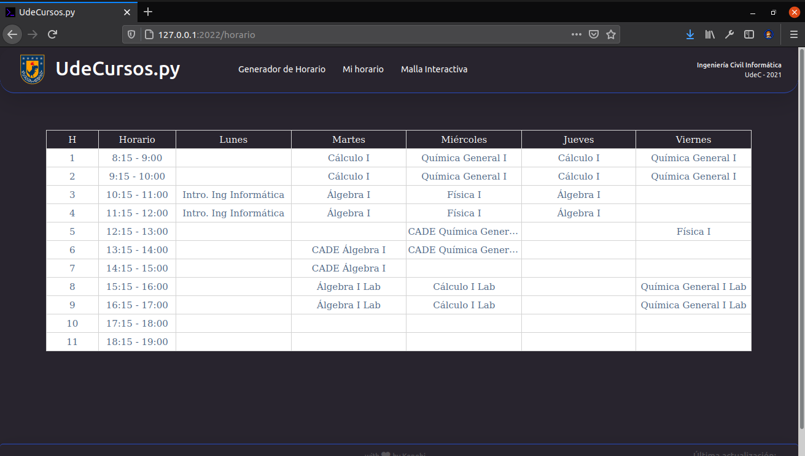
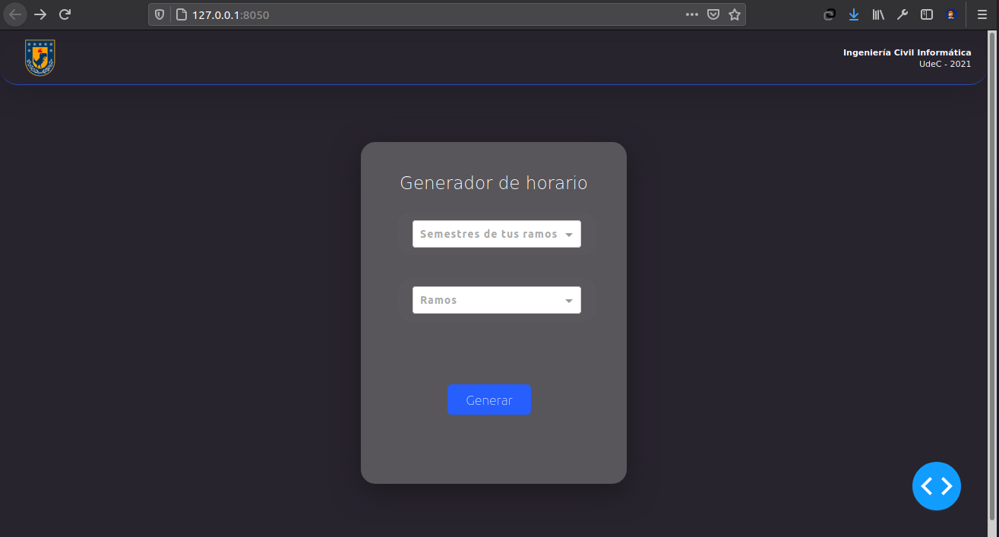

# UdeCursos.py 
> This was a conceptual version of what now is the  platform, check it out their  now!
### 🚀 Visual designed platform where students 🎓 can take a better look to their subjects and their schedules, according to their degree at the Universidad de Concepción.

## Current working stage
- [x] Problem analysis
- [x] Front-end design 🎨
- [x] Design implementation
- [x] Back-end design 👤
- [ ] Back-end implementation
- [ ] Testing
- [ ] Release
- [ ] Further maintenance
- [x] ☕💻 Drink coffee while coding

# Pre-Release views 
> last update: 5th April

# Beta Previews 
> last update: 29th March

### Last code update 5th April, 2021

 Paleta
